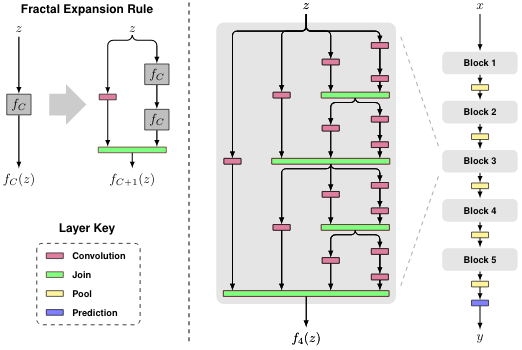

## VGG

## Inception

## Resnet

## Fractalnet
G. Larsson, M. Maire, G. Shakhnarovich, 2016, FractalNet: Ultra-Deep Neural Networks without Residuals
- Introduces two new innovations:
    - fractalnet modules
    - droppath: a technique similar to dropout, but applied to paths.

- http://people.cs.uchicago.edu/~larsson/fractalnet/
- http://arxiv.org/abs/1605.07648
- https://github.com/gustavla/fractalnet  (in Cafe)

The below diagrams are taken from [here](http://people.cs.uchicago.edu/~larsson/fractalnet/)

**fractalnet module**:

**droppath**:

