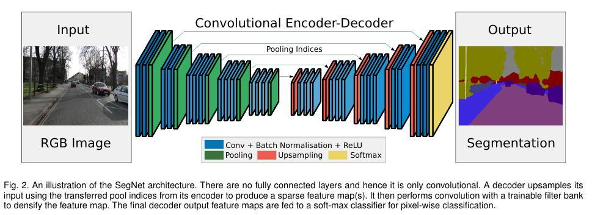
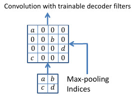

# Image Segmentation Literature

[Badrinarayanan et al 2015's SegNet][segnet]

Image of the segnet architecture (taken from [Badrinarayanan et al 2015][segnet])

Image of how segnet does upsampling (taken from [Badrinarayanan et al 2015][segnet]).

- SegNet
- The encoder network consists of 13 convolutional layers which correspond to the first 13 convolutional layers in the VGG16 network
- Upsampling is done through unpooling operation that remembers the index of the elements that were preserved during the corresponding pooling operation.
- The unpooling operation is then followed by a stack of convolution layers.
- Each upsampling stack mirrors the corresponding downsampling stack in all its dimensions (the number of convolution layers, the number of filters per convolution layer)
-

[Long et al 2014's Fully Convolutional Networks][fcn]
- Fully Convolutional network for segmentation.
- Contains fully connected layers?
- uses COnditional Random Fields?
- Apparently is very popular and widely used (according to [Badrinarayanan et al 2015 p.5][segnet])

[Noh et al 2015's DeconvNet][deconvnet]
- DeconvNet
- According to [Badrinarayanan et al 2015][segnet] this architecture is hard to train end-to-end.
- Needs more computational resources than SegNet.
- Uses fully connected layers (but in a convolutional manner?(according to [Badrinarayanan et al 2015][segnet])).

[Ronneberger et al 2015's U-net][unet]
- Unet
- transfers the entire feature map from downsampling layers to the upsampling layers.

[Chen et al 2014's DeepLab][deeplab]
- 71.6% IOU on PASCAL VOC-2012 semantic image segmentation task
- Set a new state of the art at the time it was released.
- Seems to be REALLY fast.
- 8 frames per second on a GPU (in 2014)
- Makes use of  fully connected Conditional Random Fields (CRF) (?? What is that?)
- Makes use of the 'hole' algorithm from the wavelet community (?? What is that?)
- Small model taking up 83MB of disk space (accordin to [Badrinarayanan et al 2015 p.13][segnet])

[Paszke et al 2016's Enet][enet]
- ENet (efficient neural network)
- ENet is up to 18× faster, requires 75× less FLOPs, has 79× less parameters, and provides similar or better accuracy to existing models.

[Zhao et al 2017][icnet]

[Romera et al 2017][romera2017]

[Romera et al 2017b's ERFNet][erfnet]
- TODO: Add link to erfnet. Papaer to be published in December 2017.
- Look at Romeras website for the link. 

## Comparing Models

Computational resources of different models. Table taken from [Badrinarayanan et al 2015 p.13][segnet]

Network | Forward pass(ms) | Backward pass(ms) | GPU training memory (MB) | GPU inference memory (MB) | Model size (MB)
---|---|---|---|---|---
SegNet              | 422.50    | 488.71 | 6803 | 1052 | 117
DeepLab-LargeFOV    | 110.06    | 160.73 | 5618 | 1993 | 83
FCN (learnt deconv) | 317.09    | 484.11 | 9735 | 1806 | 539
DeconvNet           | 474.65    | 602.15 | 9731 | 1872 | 877

## References
- [Badrinarayanan et al 2015][segnet]
    - Vijay Badrinarayanan, Alex Kendall, Roberto Cipolla, "SegNet: A Deep Convolutional Encoder-Decoder Architecture for Image Segmentation", 2015
- [Chen et al 2014][deeplab]
    - Liang-Chieh Chen, George Papandreou, Iasonas Kokkinos, Kevin Murphy, Alan L. Yuille, "Semantic Image Segmentation with Deep Convolutional Nets and Fully Connected CRFs", 2014
- [Long et al 2014][fcn]
    - J. Long, E. Shelhamer, and T. Darrell, "Fully convolutional networks for semantic segmentation", 2014
- [Noh et al 2015][deconvnet]
    - H. Noh, S. Hong, and B. Han, "Learning deconvolution network for semantic segmentation", 2015
- [Paszke et al 2016][enet]
    - Adam Paszke, Abhishek Chaurasia, Sangpil Kim, Eugenio Culurciello, "ENet: A Deep Neural Network Architecture for Real-Time Semantic Segmentation", 2016
- [Romera et al 2017][romera2017]
    - Eduardo Romera, Jose M. Alvarez, Luis M. Bergasa1 and Roberto Arroyo: "Efficient ConvNet for Real-time Semantic Segmentation", 2017
- [Ronneberger et al 2015's U-net][unet]
    - Olaf Ronneberger, Philipp Fischer, Thomas Brox: "U-Net: Convolutional Networks for Biomedical Image Segmentation", 2015
- [Zhao et al 2017][icnet]
    - Hengshuang Zhao, Xiaojuan Qi, Xiaoyong Shen, Jianping Shi, Jiaya Jia: "ICNet for Real-Time Semantic Segmentation on High-Resolution Images", 2017

[deconvnet]: https://arxiv.org/abs/1505.04366
[deeplab]: https://arxiv.org/abs/1412.7062
[enet]: https://arxiv.org/abs/1606.02147
[fcn]: https://arxiv.org/abs/1411.4038
[romera2017]: http://www.robesafe.uah.es/personal/eduardo.romera/pdfs/Romera17iv.pdf
[segnet]: https://arxiv.org/abs/1511.00561
[unet]: https://arxiv.org/abs/1505.04597
[icnet]: https://arxiv.org/abs/1704.08545
