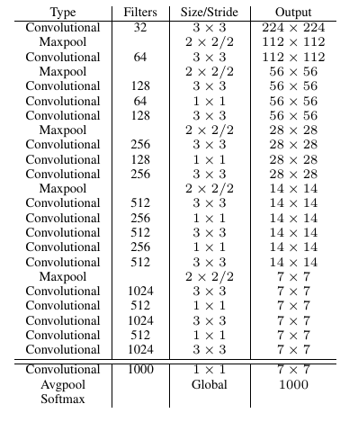

# Object Detection Lit Review

- TODO: Add diagrams of architectures.

[Overfeat][overfeat]
- One of the first deep learning approaches to object detection.
- 2013
- multi-scale sliding window algorithm using conv nets.
-

[Ross Girshick, et al 2014's R-CNN][rcnn]
- Regions with CNN features.
- Approx 50% improvement over overfeat.
- Three stages:
    - Region Proposals (Selective Search).
    - Extract features from each region using a CNN.
    - Classify each region with SVMs.
- Really complex to train.

[Girshick 2015's Fast R-CNN][fast_rcnn]
- Regions of Interest using Selective Search Algorithm
- Object proposals.
- Can be trained end to end.

[Redmon et al 2015's Yolo][yolo]
- First one to provide real time performance

[Ren et al 2016's Faster R-CNN][faster_rcnn]
- Region Proposal Network (RPN) (instead of selective search)

[Liu et al 2015's SSD][ssd]
- SIngle Shot Detector
- multiple sized convolutional maps

[Dai et al2016's R-FCN][rfcn]
- SImilar to Faster R-CNN, but fully convolutional.

[Redmon et al 2016's Yolo 2][yolo2]
- Uses the darknet19 architecture as the base classifier.
- 

# TODO: Add full references.

[overfeat]: https://arxiv.org/abs/1312.6229
[rcnn]: https://arxiv.org/abs/1311.2524
[fast_rcnn]: https://arxiv.org/abs/1504.08083
[yolo]: https://arxiv.org/abs/1506.02640
[faster_rcnn]: https://arxiv.org/abs/1506.01497
[rfcn]: https://arxiv.org/abs/1605.06409
[yolo2]: http://
